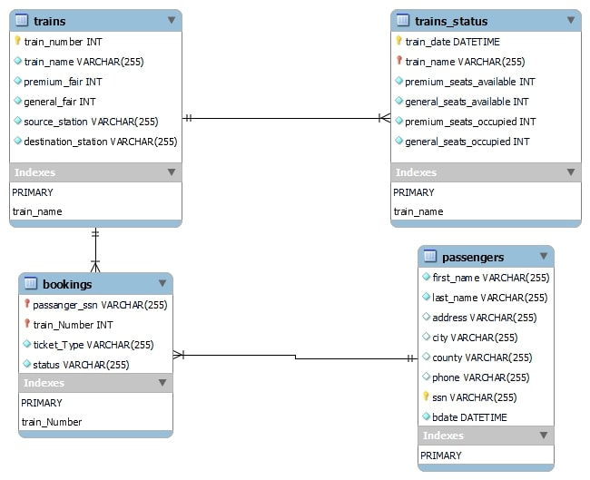

# RRS(Railway Reservation System)

A railway management system. It can help you track your tickets and train schedules.

## How to run up the server

Step 1: Download the ZIP folder of the code and extract it.

Step 2: CD into the extracted folder

```console
cd "path to the folder"
```

Step 3: Download python from [Python](https://www.python.org/downloads/).

Step 4: Follow the steps from [PIP](https://pip.pypa.io/en/stable/installation/) to install it.

Step 5: Install the requirements

```console
pip install -r requirements.txt
```

Step 6: Intialize the Database

```console
flask --app app init-db
```

Step 7: Run the app

```console
flask --app app run --host=0.0.0.0
```

Optional Step: If you want to run the app in debug mode run by add --debug option

```console
flask --app app run --debug --host=0.0.0.0
```

## Database Schema



## Queries

##### Query 1: User input the passenger’s last name and first name and retrieve all trains they are booked on

```sql
SELECT DISTINCT(t.train_name) FROM (Passengers as p INNER JOIN Bookings AS b ON p.ssn = b.passanger_ssn) INNER JOIN Trains AS t ON b.train_Number = t.train_number WHERE p.first_name = 'James' AND p.last_name = 'Butt';
```

##### Query 2: User input the Date and list of passengers travelling on entered day with confirmed ticketsdisplays on UI.

```sql
SELECT (p.first_name|| " "||p.last_name) AS full_name FROM Bookings AS b JOIN Trains as t ON b.train_Number = t.train_number JOIN Passengers as p ON p.ssn = b.passanger_ssn WHERE b.status = 'Booked' AND t.train_number in (SELECT t.train_number FROM Trains_Status AS ts JOIN Trains AS t ON ts.train_name = t.train_name WHERE ts.train_date = '2022-02-19');
```

##### Query 3: User input the age of the passenger (50 to 60) and UI display the train information (TrainNumber, Train Name, Sourceand Destination) and passenger information (Name, Address,Category, ticket status) of passengers who are between the ages of 50 to 60.

```sql
SELECT t.train_number,t.train_name, t.source_station, t.destination_station, p.first_name, p.last_name, p.address, b.ticket_Type as category, b.status as status, cast(strftime('%Y', 'now') - strftime('%Y', bdate) as int)  AS age FROM Trains AS t JOIN Bookings AS b ON b.train_Number = t.train_number Join Passengers AS p ON p.ssn = b.passanger_ssn WHERE age BETWEEN 50 AND 60 ORDER BY age;
```

##### Query 4: List all the train name along with count of passengers it is carrying.

```sql
SELECT train_name, train_date, (premium_seats_occupied+general_seats_occupied) AS passengers_count FROM Trains_Status;
```

##### Query 5: Enter a train name and retrieve all the passengers with confirmed status travelling in that train.

```sql
SELECT (p.first_name ||' ' || p.last_name) AS full_name FROM Passengers as p JOIN Bookings as b ON p.ssn = b.passanger_ssn JOIN Train as t ON b.train_Number = t.train_number WHERE t.train_name = 'Flying Scottsman' AND b.status = 'Booked';
```

##### Query 6: User Cancel a ticket (delete a record) and show that passenger in waiting list get ticketconfirmed

- Query to check if passenger has a ticket booked for train

```sql
SELECT * FROM Bookings WHERE status = 'Booked' AND passanger_ssn = '264816896' AND train_Number = '3' AND ticket_Type = 'Premium';
```

- Delete the ticket if it exists

```sql
DELETE FROM Bookings WHERE status = 'Booked' AND passanger_ssn = '264816896' AND train_Number = '3' AND ticket_Type = 'Premium';
```

- Get the next passenger on waitlist

```sql
SELECT * FROM Bookings WHERE status = 'WaitL' AND train_Number = '3' AND ticket_Type = 'Premium' LIMIT 1;
```

- Update if there is a passenger on waitlist

```sql
UPDATE Bookings SET status = "Booked" WHERE status = 'WaitL' AND passanger_ssn = '256558303' AND train_Number = '3' AND ticket_Type = 'Premium'
```
